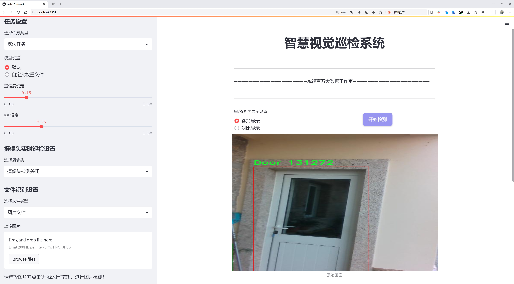
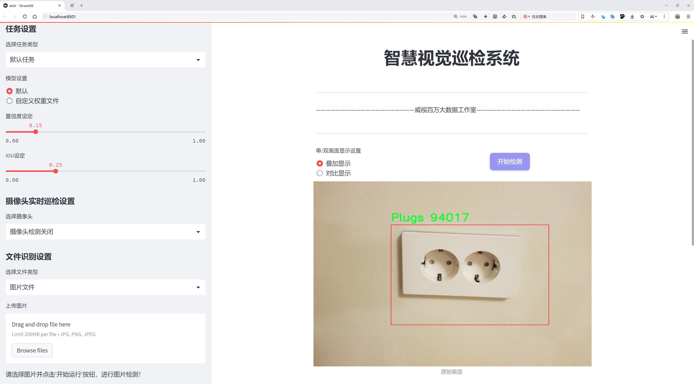
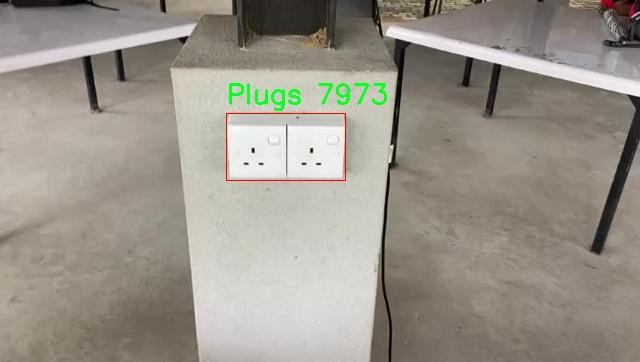
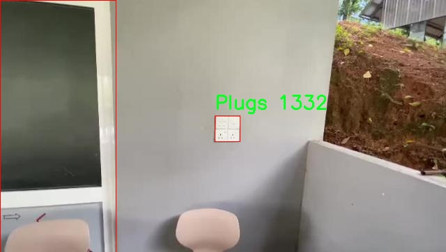
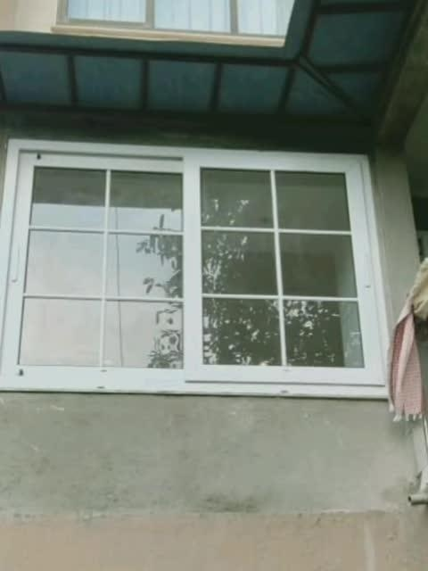
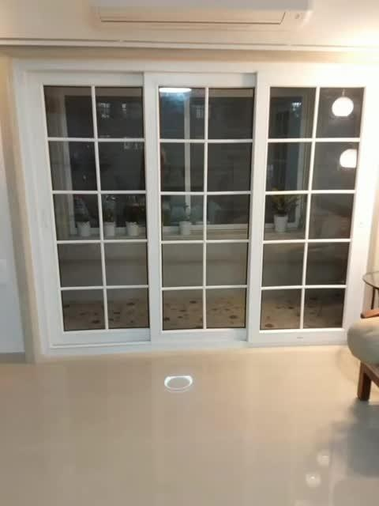
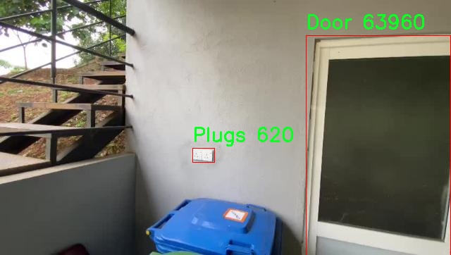

# 婴儿接触危险物品检测检测系统源码分享
 # [一条龙教学YOLOV8标注好的数据集一键训练_70+全套改进创新点发刊_Web前端展示]

### 1.研究背景与意义

项目参考[AAAI Association for the Advancement of Artificial Intelligence](https://gitee.com/qunshansj/projects)

项目来源[AACV Association for the Advancement of Computer Vision](https://gitee.com/qunmasj/projects)

研究背景与意义

随着社会的发展和生活水平的提高，家庭环境的安全性愈发受到重视。尤其是在有婴儿的家庭中，婴儿的安全问题更是家长关注的焦点。婴儿的好奇心和探索欲使他们容易接触到潜在的危险物品，如插座、窗户、门等，这些物品在日常生活中往往被忽视，但却可能对婴儿的安全构成严重威胁。因此，开发一种高效的婴儿接触危险物品检测系统显得尤为重要。

近年来，计算机视觉技术的迅猛发展为安全监测提供了新的解决方案。YOLO（You Only Look Once）系列模型作为一种先进的目标检测算法，以其高效性和准确性在各类应用中取得了显著成效。YOLOv8作为该系列的最新版本，具备更强的特征提取能力和更快的推理速度，适合实时监测场景。通过对YOLOv8进行改进，结合特定的婴儿接触危险物品检测需求，可以有效提升系统的检测精度和响应速度，从而为婴儿的安全提供更为可靠的保障。

本研究所使用的数据集包含2035张图像，涵盖了6个类别：婴儿、门、插座、窗户、椅子和桌子。这些类别的选择基于对家庭环境中常见危险物品的分析，能够全面反映婴儿可能接触到的风险因素。通过对这些图像进行标注和训练，改进后的YOLOv8模型将能够实时识别和定位这些危险物品，从而为家长提供及时的警示，减少意外事故的发生。

此外，随着智能家居技术的普及，将婴儿接触危险物品检测系统与智能家居设备相结合，能够实现更为智能化的安全监控。例如，当系统检测到婴儿接触到危险物品时，可以通过智能音箱发出警报，或通过手机应用向家长发送通知。这种智能化的解决方案不仅提升了家庭安全管理的效率，也为家长提供了更为便捷的监控手段。

本研究的意义不仅在于技术的创新和应用，更在于对婴儿安全问题的重视和解决。通过构建基于改进YOLOv8的婴儿接触危险物品检测系统，可以有效降低婴儿因接触危险物品而导致的意外伤害风险，提升家庭的安全水平。同时，该系统的研究成果也为后续相关领域的研究提供了借鉴，推动了计算机视觉技术在安全监测领域的应用发展。

综上所述，基于改进YOLOv8的婴儿接触危险物品检测系统的研究，不仅具有重要的学术价值，也为实际应用提供了切实可行的解决方案。随着技术的不断进步和完善，未来该系统有望在更广泛的场景中推广应用，为更多家庭的安全保驾护航。

### 2.图片演示






##### 注意：由于此博客编辑较早，上面“2.图片演示”和“3.视频演示”展示的系统图片或者视频可能为老版本，新版本在老版本的基础上升级如下：（实际效果以升级的新版本为准）

  （1）适配了YOLOV8的“目标检测”模型和“实例分割”模型，通过加载相应的权重（.pt）文件即可自适应加载模型。

  （2）支持“图片识别”、“视频识别”、“摄像头实时识别”三种识别模式。

  （3）支持“图片识别”、“视频识别”、“摄像头实时识别”三种识别结果保存导出，解决手动导出（容易卡顿出现爆内存）存在的问题，识别完自动保存结果并导出到tempDir中。

  （4）支持Web前端系统中的标题、背景图等自定义修改，后面提供修改教程。

  另外本项目提供训练的数据集和训练教程,暂不提供权重文件（best.pt）,需要您按照教程进行训练后实现图片演示和Web前端界面演示的效果。

### 3.视频演示

[3.1 视频演示](https://www.bilibili.com/video/BV1QxtYeGESi/)

### 4.数据集信息展示

##### 4.1 本项目数据集详细数据（类别数＆类别名）

nc: 6
names: ['Baby', 'Door', 'Plugs', 'Window', 'chair', 'table']


##### 4.2 本项目数据集信息介绍

数据集信息展示

在本研究中，我们采用了名为“Harmful_Object_Identification”的数据集，以训练和改进YOLOv8模型，旨在开发一个高效的婴儿接触危险物品检测系统。该数据集专门设计用于识别与婴儿安全相关的物品，涵盖了六个主要类别，分别是“Baby”（婴儿）、“Door”（门）、“Plugs”（插头）、“Window”（窗户）、“chair”（椅子）和“table”（桌子）。这些类别的选择不仅反映了婴儿在日常生活中可能接触到的物品，还考虑到了这些物品潜在的危险性。

数据集的核心在于其丰富的标注信息和多样化的图像样本。每个类别都包含大量的图像，涵盖了不同的场景、光照条件和角度，确保模型在各种环境下都能保持良好的识别性能。例如，在“Baby”类别中，数据集包含了不同年龄段的婴儿在多种家庭环境中的图像，这些图像展示了婴儿与周围物品的互动情况，帮助模型学习识别婴儿的姿态和行为特征。

在“Door”类别中，数据集提供了各种类型的门，包括室内门和室外门，展示了门的开启与关闭状态，以及婴儿可能接触到门的不同情境。这种多样性使得模型能够有效识别婴儿在接近门时的潜在危险，并及时发出警报。

“Plugs”类别则专注于电源插头的识别，数据集中包含了不同类型的插头，包括墙壁插座和延长线插座。通过这些图像，模型能够学习到插头的外观特征及其在家庭环境中的常见位置，从而在婴儿接触到插头时发出警示。

“Window”类别同样至关重要，数据集展示了各种窗户的样式与状态，帮助模型理解窗户的开合情况及其对婴儿安全的影响。通过对窗户的识别，系统能够有效预警婴儿可能面临的跌落风险。

在“chair”和“table”类别中，数据集涵盖了多种款式和尺寸的椅子与桌子，展示了婴儿在这些家具周围的活动情况。这些图像不仅有助于模型识别家具的存在，还能分析婴儿与家具的相对位置，从而判断潜在的碰撞或跌倒风险。

总的来说，“Harmful_Object_Identification”数据集通过丰富的类别和多样化的图像样本，为YOLOv8模型的训练提供了坚实的基础。数据集的设计充分考虑了婴儿在家庭环境中的行为模式和安全隐患，确保模型能够在实际应用中有效识别危险物品，保护婴儿的安全。通过对该数据集的深入分析与应用，我们期望能够显著提升婴儿接触危险物品检测系统的准确性和可靠性，为家庭提供更安全的生活环境。











### 5.全套项目环境部署视频教程（零基础手把手教学）

[5.1 环境部署教程链接（零基础手把手教学）](https://www.ixigua.com/7404473917358506534?logTag=c807d0cbc21c0ef59de5)


[5.2 安装Python虚拟环境创建和依赖库安装视频教程链接（零基础手把手教学）](https://www.ixigua.com/7404474678003106304?logTag=1f1041108cd1f708b01a)

### 6.手把手YOLOV8训练视频教程（零基础小白有手就能学会）

[6.1 手把手YOLOV8训练视频教程（零基础小白有手就能学会）](https://www.ixigua.com/7404477157818401292?logTag=d31a2dfd1983c9668658)

### 7.70+种全套YOLOV8创新点代码加载调参视频教程（一键加载写好的改进模型的配置文件）

[7.1 70+种全套YOLOV8创新点代码加载调参视频教程（一键加载写好的改进模型的配置文件）](https://www.ixigua.com/7404478314661806627?logTag=29066f8288e3f4eea3a4)

### 8.70+种全套YOLOV8创新点原理讲解（非科班也可以轻松写刊发刊，V10版本正在科研待更新）

由于篇幅限制，每个创新点的具体原理讲解就不一一展开，具体见下列网址中的创新点对应子项目的技术原理博客网址【Blog】：


[8.1 70+种全套YOLOV8创新点原理讲解链接](https://gitee.com/qunmasj/good)

### 9.系统功能展示（检测对象为举例，实际内容以本项目数据集为准）

图9.1.系统支持检测结果表格显示

  图9.2.系统支持置信度和IOU阈值手动调节

  图9.3.系统支持自定义加载权重文件best.pt(需要你通过步骤5中训练获得)

  图9.4.系统支持摄像头实时识别

  图9.5.系统支持图片识别

  图9.6.系统支持视频识别

  图9.7.系统支持识别结果文件自动保存

  图9.8.系统支持Excel导出检测结果数据


### 10.原始YOLOV8算法原理

原始YOLOv8算法原理

YOLOv8算法是Ultralytics公司在2023年推出的目标检测领域的最新版本，它在前几代YOLO模型的基础上进行了显著的改进和优化，旨在实现更高的检测精度和更快的推理速度。YOLOv8的设计理念围绕着快速、准确和易于使用的目标检测任务展开，成为了图像分割和图像分类等多种应用场景中的理想选择。

YOLOv8的网络结构由多个模块组成，其中输入模块是整个算法的起点。默认情况下，YOLOv8接收640x640像素的图像作为输入。然而，在实际应用中，图像的长宽比往往各不相同，因此YOLOv8采用了一种自适应的图像缩放策略。在进行模型推理时，算法会将图像的长边按比例缩小到指定尺寸，并对缩小后的短边进行填充。这种处理方式不仅有效减少了信息冗余，还提升了目标检测的速度。此外，在训练阶段，YOLOv8引入了Mosaic图像增强技术，通过将四张不同的图像随机缩放并拼接成一张新图像，增强了模型对不同位置和周围像素的学习能力，从而提高了预测精度。

在网络的主干部分，YOLOv8对C3模块进行了替换，采用了C2F模块，这一变化源于对YOLOv7中ELAN模块设计思想的借鉴。C2F模块通过引入更多的跳层连接，能够获取更丰富的梯度流信息，同时保持了模型的轻量化特性。这种结构的优化不仅提升了特征提取的能力，还在保证计算效率的前提下，增强了模型的表达能力。

YOLOv8的Neck部分同样经历了结构上的变革，所有的C3模块被更为高效的C2F模块所替代，并且在上采样阶段去除了多余的卷积连接层。这一设计使得特征图的处理更加简洁高效，进一步提升了模型的性能。

在Head部分，YOLOv8实现了从Coupled-Head（耦合头）到Decoupled-Head（解耦头）的转变。传统的耦合头结构将检测和分类任务共用一个卷积，而YOLOv8则将这两个任务分开处理。通过两个独立的分支，分别进行类别预测和边界框位置的回归，YOLOv8能够更好地聚焦于不同任务的特征提取，从而提高了模型的收敛速度和预测精度。

此外，YOLOv8抛弃了以往的Anchor-Based（基于锚框）检测思想，转而采用Anchor-Free（无锚框）的方法。这一创新使得目标检测的过程更加灵活，模型不再依赖于预设的锚框进行位置回归，而是将目标检测问题转化为关键点检测。这种方法的优点在于，减少了计算复杂度，同时提高了模型的泛化能力，使得YOLOv8能够适应不同的数据集和目标物体。

在损失函数的设计上，YOLOv8引入了新的策略，通过变焦损失计算分类损失，并结合数据平均保真度损失和完美交并比损失来计算边界框损失。这种新的损失策略使得模型在训练过程中能够更快地聚焦于标签附近的数值，从而提升了目标检测的准确性。

YOLOv8在COCOval2017数据集上的表现证明了其卓越的性能。通过一系列的实验和对比，YOLOv8在检测精度和推理速度上均优于其前身YOLOv5、YOLOv6和YOLOv7等版本。这一系列的改进和创新使得YOLOv8不仅在理论上具有重要的学术价值，同时在实际应用中也展现出了广泛的应用潜力。

综上所述，YOLOv8算法的原理和结构设计充分体现了现代目标检测技术的发展趋势。通过引入自适应图像缩放、优化的主干网络、解耦的检测头以及无锚框的检测策略，YOLOv8在保持高效性的同时，极大地提升了目标检测的准确性和灵活性。这些特性使得YOLOv8成为了当前目标检测领域中最具竞争力的算法之一，为未来的研究和应用提供了广阔的空间。


### 11.项目核心源码讲解（再也不用担心看不懂代码逻辑）

#### 11.1 70+种YOLOv8算法改进源码大全和调试加载训练教程（非必要）\ultralytics\utils\callbacks\dvc.py

以下是经过精简和注释的核心代码部分，主要功能是使用DVCLive进行训练过程中的日志记录和可视化。

```python
# 导入必要的库
from ultralytics.utils import LOGGER, SETTINGS, TESTS_RUNNING, checks
import os
import re
from pathlib import Path

# 尝试导入DVCLive并进行版本检查
try:
    assert not TESTS_RUNNING  # 确保不是在测试环境中
    assert SETTINGS['dvc'] is True  # 确保DVC集成已启用
    import dvclive
    assert checks.check_version('dvclive', '2.11.0', verbose=True)

    # DVCLive日志实例
    live = None
    _processed_plots = {}  # 存储已处理的图表
    _training_epoch = False  # 标记当前是否在训练周期

except (ImportError, AssertionError, TypeError):
    dvclive = None  # 如果导入失败，则将dvclive设置为None

def _log_images(path, prefix=''):
    """记录指定路径的图像，使用DVCLive进行日志记录。"""
    if live:  # 如果DVCLive实例存在
        name = path.name
        # 通过批次分组图像，以便在UI中启用滑块
        m = re.search(r'_batch(\d+)', name)
        if m:
            ni = m[1]
            new_stem = re.sub(r'_batch(\d+)', '_batch', path.stem)
            name = (Path(new_stem) / ni).with_suffix(path.suffix)

        live.log_image(os.path.join(prefix, name), path)  # 记录图像

def on_pretrain_routine_start(trainer):
    """在预训练例程开始时初始化DVCLive日志记录器。"""
    try:
        global live
        live = dvclive.Live(save_dvc_exp=True, cache_images=True)  # 创建DVCLive实例
        LOGGER.info("DVCLive已检测到，自动日志记录已启用。")
    except Exception as e:
        LOGGER.warning(f'警告：DVCLive安装但未正确初始化，未记录此运行。{e}')

def on_train_start(trainer):
    """如果DVCLive日志记录处于活动状态，则记录训练参数。"""
    if live:
        live.log_params(trainer.args)  # 记录训练参数

def on_fit_epoch_end(trainer):
    """在每个训练周期结束时记录训练指标和模型信息。"""
    global _training_epoch
    if live and _training_epoch:
        all_metrics = {**trainer.label_loss_items(trainer.tloss, prefix='train'), **trainer.metrics, **trainer.lr}
        for metric, value in all_metrics.items():
            live.log_metric(metric, value)  # 记录每个指标

        live.next_step()  # 进入下一个步骤
        _training_epoch = False  # 重置训练周期标记

def on_train_end(trainer):
    """在训练结束时记录最佳指标、图表和混淆矩阵。"""
    if live:
        all_metrics = {**trainer.label_loss_items(trainer.tloss, prefix='train'), **trainer.metrics, **trainer.lr}
        for metric, value in all_metrics.items():
            live.log_metric(metric, value, plot=False)  # 记录最佳指标

        # 记录混淆矩阵
        _log_confusion_matrix(trainer.validator)

        live.end()  # 结束日志记录

# 回调函数字典
callbacks = {
    'on_pretrain_routine_start': on_pretrain_routine_start,
    'on_train_start': on_train_start,
    'on_fit_epoch_end': on_fit_epoch_end,
    'on_train_end': on_train_end
} if dvclive else {}
```

### 代码注释说明：
1. **导入部分**：导入必要的库和模块，包括Ultralytics的工具和DVCLive。
2. **DVCLive初始化**：在训练开始时初始化DVCLive日志记录器，并进行版本检查。
3. **图像记录**：定义了一个函数用于记录图像，支持按批次分组以便于可视化。
4. **训练过程中的回调**：定义了多个回调函数，在训练的不同阶段记录参数、指标和混淆矩阵等信息。
5. **回调字典**：根据DVCLive的状态选择合适的回调函数进行日志记录。

这样精简后的代码保留了核心功能，并添加了详细的中文注释以便理解。

这个文件是一个用于YOLO（You Only Look Once）模型训练过程中的回调函数实现，主要目的是集成DVCLive工具以记录和可视化训练过程中的各种信息。代码首先导入了一些必要的模块和库，并进行了一些初步的检查，确保DVCLive的集成是启用的。

在代码中，首先定义了一个`live`变量用于存储DVCLive的实例，以及一个字典`_processed_plots`用于记录已经处理过的图像。接着，定义了一些私有函数，例如`_log_images`、`_log_plots`和`_log_confusion_matrix`，这些函数负责记录图像、训练进度图和混淆矩阵等信息。

`_log_images`函数会根据给定的路径和前缀记录图像，支持将图像按批次分组以便在用户界面中显示滑块。`_log_plots`函数则会记录训练过程中的图像，如果这些图像之前没有被处理过。`_log_confusion_matrix`函数用于记录混淆矩阵，帮助分析模型的分类效果。

接下来，定义了一系列的回调函数，这些函数会在训练的不同阶段被调用。例如，`on_pretrain_routine_start`函数在预训练开始时初始化DVCLive的日志记录；`on_train_start`函数在训练开始时记录训练参数；`on_fit_epoch_end`函数在每个训练周期结束时记录训练指标和模型信息，并推进到下一个步骤；`on_train_end`函数在训练结束时记录最佳指标、图像和混淆矩阵。

最后，代码将这些回调函数存储在一个字典中，只有在DVCLive可用的情况下才会执行。这些回调函数的设计使得在训练过程中能够实时记录和可视化模型的性能，便于开发者分析和调试模型的训练过程。整体上，这个文件为YOLO模型的训练提供了一个灵活且强大的日志记录机制。

#### 11.2 code\ultralytics\utils\patches.py

以下是经过简化和注释的核心代码部分：

```python
import time
from pathlib import Path
import cv2
import numpy as np
import torch

# 读取图像文件的函数
def imread(filename: str, flags: int = cv2.IMREAD_COLOR):
    """
    从文件中读取图像。

    参数:
        filename (str): 要读取的文件路径。
        flags (int, optional): 图像读取标志，默认为 cv2.IMREAD_COLOR。

    返回:
        (np.ndarray): 读取的图像。
    """
    # 使用 cv2.imdecode 从文件中读取图像
    return cv2.imdecode(np.fromfile(filename, np.uint8), flags)

# 写入图像文件的函数
def imwrite(filename: str, img: np.ndarray, params=None):
    """
    将图像写入文件。

    参数:
        filename (str): 要写入的文件路径。
        img (np.ndarray): 要写入的图像。
        params (list of ints, optional): 额外参数，参考 OpenCV 文档。

    返回:
        (bool): 如果文件写入成功返回 True，否则返回 False。
    """
    try:
        # 使用 cv2.imencode 将图像编码并写入文件
        cv2.imencode(Path(filename).suffix, img, params)[1].tofile(filename)
        return True
    except Exception:
        return False

# 显示图像的函数
def imshow(winname: str, mat: np.ndarray):
    """
    在指定窗口中显示图像。

    参数:
        winname (str): 窗口名称。
        mat (np.ndarray): 要显示的图像。
    """
    # 使用 OpenCV 的 imshow 函数显示图像
    cv2.imshow(winname.encode("unicode_escape").decode(), mat)

# 保存 PyTorch 模型的函数
def torch_save(*args, **kwargs):
    """
    使用 dill 序列化 lambda 函数，并在保存失败时进行重试。

    参数:
        *args (tuple): 传递给 torch.save 的位置参数。
        **kwargs (dict): 传递给 torch.save 的关键字参数。
    """
    try:
        import dill as pickle  # 尝试导入 dill 模块
    except ImportError:
        import pickle  # 如果没有 dill，则使用 pickle

    # 如果没有指定 pickle_module，则使用默认的 pickle
    if "pickle_module" not in kwargs:
        kwargs["pickle_module"] = pickle

    for i in range(4):  # 最多重试 3 次
        try:
            return torch.save(*args, **kwargs)  # 调用 torch.save 保存模型
        except RuntimeError:  # 如果保存失败
            if i == 3:
                raise  # 如果是最后一次重试，则抛出异常
            time.sleep((2**i) / 2)  # 等待一段时间后重试，采用指数退避策略
```

### 代码说明：
1. **imread**: 从指定路径读取图像，支持多种图像格式。
2. **imwrite**: 将图像写入指定路径，支持自定义参数。
3. **imshow**: 在窗口中显示图像，支持 Unicode 窗口名称。
4. **torch_save**: 封装 PyTorch 的保存功能，增加了对 lambda 函数的支持，并在保存失败时进行重试，增强了代码的健壮性。

这个程序文件 `patches.py` 是用于增强和扩展现有功能的猴子补丁（monkey patches），主要涉及图像处理和PyTorch的功能。文件开头的注释表明该文件属于Ultralytics YOLO项目，并遵循AGPL-3.0许可证。

首先，文件导入了一些必要的库，包括时间处理、路径操作、OpenCV、NumPy和PyTorch。接下来，定义了一些函数，这些函数主要是对OpenCV和PyTorch功能的封装和增强。

在OpenCV部分，首先定义了一个 `_imshow` 变量，用于避免递归错误。接着实现了 `imread` 函数，该函数用于从文件中读取图像。它接受文件名和读取标志作为参数，默认情况下使用彩色读取模式。函数内部使用 `cv2.imdecode` 和 `np.fromfile` 读取图像并返回为NumPy数组。

然后是 `imwrite` 函数，用于将图像写入文件。该函数接受文件名、图像数据和可选的参数列表。它尝试使用 `cv2.imencode` 将图像编码并写入指定的文件，成功时返回True，失败时返回False。

接下来是 `imshow` 函数，用于在指定窗口中显示图像。它接受窗口名称和图像数据作为参数，并调用 `_imshow` 函数来显示图像。窗口名称在传递前经过编码和解码，以确保多语言兼容性。

在PyTorch部分，定义了一个 `_torch_save` 变量以避免递归错误。然后实现了 `torch_save` 函数，该函数用于保存模型或数据。它首先尝试导入 `dill` 模块（如果存在），以处理一些 `pickle` 无法序列化的情况。如果没有找到 `dill`，则使用标准的 `pickle`。函数中还添加了重试机制，最多重试三次，以应对可能的临时问题，如设备未准备好或防病毒软件正在扫描。每次重试之间的等待时间采用指数增长的方式，以提高成功的概率。

总体来说，这个文件通过封装和增强现有的OpenCV和PyTorch功能，提高了代码的可用性和健壮性，尤其是在处理图像和保存模型时。

#### 11.3 ui.py

以下是保留的核心代码部分，并附上详细的中文注释：

```python
import sys
import subprocess

def run_script(script_path):
    """
    使用当前 Python 环境运行指定的脚本。

    Args:
        script_path (str): 要运行的脚本路径

    Returns:
        None
    """
    # 获取当前 Python 解释器的路径
    python_path = sys.executable

    # 构建运行命令，使用 streamlit 运行指定的脚本
    command = f'"{python_path}" -m streamlit run "{script_path}"'

    # 执行命令
    result = subprocess.run(command, shell=True)
    # 检查命令执行结果，如果返回码不为0，表示出错
    if result.returncode != 0:
        print("脚本运行出错。")

# 实例化并运行应用
if __name__ == "__main__":
    # 指定要运行的脚本路径
    script_path = "web.py"  # 这里可以直接指定脚本名，假设在当前目录下

    # 调用函数运行脚本
    run_script(script_path)
```

### 注释说明：
1. **导入模块**：
   - `sys`：用于获取当前 Python 解释器的路径。
   - `subprocess`：用于执行外部命令。

2. **`run_script` 函数**：
   - 该函数接受一个参数 `script_path`，表示要运行的 Python 脚本的路径。
   - 使用 `sys.executable` 获取当前 Python 解释器的路径。
   - 构建一个命令字符串，使用 `streamlit` 模块运行指定的脚本。
   - 使用 `subprocess.run` 执行命令，并检查返回码以判断脚本是否成功运行。

3. **主程序部分**：
   - 使用 `if __name__ == "__main__":` 确保该部分代码仅在脚本作为主程序运行时执行。
   - 指定要运行的脚本路径（这里假设脚本名为 `web.py`）。
   - 调用 `run_script` 函数来执行指定的脚本。

这个程序文件名为 `ui.py`，主要功能是使用当前的 Python 环境来运行一个指定的脚本。程序首先导入了必要的模块，包括 `sys`、`os` 和 `subprocess`，以及一个自定义的模块 `QtFusion.path` 中的 `abs_path` 函数。

在 `run_script` 函数中，程序接收一个参数 `script_path`，这个参数是要运行的脚本的路径。函数首先获取当前 Python 解释器的路径，并将其存储在 `python_path` 变量中。接着，程序构建了一个命令字符串，使用 `streamlit` 模块来运行指定的脚本。这个命令的格式是 `"{python_path}" -m streamlit run "{script_path}"`，其中 `{python_path}` 和 `{script_path}` 会被实际的路径替换。

随后，程序使用 `subprocess.run` 方法来执行这个命令，`shell=True` 参数表示命令将在一个新的 shell 中运行。执行后，程序检查返回的结果，如果返回码不为 0，说明脚本运行出错，程序会打印出“脚本运行出错。”的提示信息。

在文件的最后部分，程序通过 `if __name__ == "__main__":` 判断是否是直接运行该脚本。如果是，程序会调用 `abs_path` 函数来获取 `web.py` 脚本的绝对路径，并将其传递给 `run_script` 函数，从而启动该脚本的运行。

总的来说，这个程序的主要目的是方便地在当前 Python 环境中运行一个名为 `web.py` 的脚本，并处理可能出现的错误。

#### 11.4 code\ultralytics\data\build.py

以下是代码中最核心的部分，并附上详细的中文注释：

```python
import os
import random
import numpy as np
import torch
from torch.utils.data import dataloader

from .dataset import YOLODataset  # 导入YOLO数据集类
from .utils import PIN_MEMORY  # 导入内存固定标志

class InfiniteDataLoader(dataloader.DataLoader):
    """
    无限循环的数据加载器，重用工作线程。
    """

    def __init__(self, *args, **kwargs):
        """初始化无限数据加载器，继承自DataLoader。"""
        super().__init__(*args, **kwargs)
        object.__setattr__(self, "batch_sampler", _RepeatSampler(self.batch_sampler))  # 使用重复采样器
        self.iterator = super().__iter__()  # 初始化迭代器

    def __len__(self):
        """返回批次采样器的长度。"""
        return len(self.batch_sampler.sampler)

    def __iter__(self):
        """创建一个无限重复的采样器。"""
        for _ in range(len(self)):
            yield next(self.iterator)  # 返回下一个样本

    def reset(self):
        """
        重置迭代器。

        当我们想在训练过程中修改数据集设置时，这非常有用。
        """
        self.iterator = self._get_iterator()  # 重新获取迭代器


class _RepeatSampler:
    """
    永久重复的采样器。

    参数:
        sampler (Dataset.sampler): 要重复的采样器。
    """

    def __init__(self, sampler):
        """初始化一个永久重复给定采样器的对象。"""
        self.sampler = sampler

    def __iter__(self):
        """迭代'采样器'并返回其内容。"""
        while True:
            yield from iter(self.sampler)  # 无限迭代采样器


def seed_worker(worker_id):
    """设置数据加载器工作线程的随机种子。"""
    worker_seed = torch.initial_seed() % 2**32  # 获取工作线程的随机种子
    np.random.seed(worker_seed)  # 设置numpy随机种子
    random.seed(worker_seed)  # 设置Python随机种子


def build_yolo_dataset(cfg, img_path, batch, data, mode="train", rect=False, stride=32):
    """构建YOLO数据集。"""
    return YOLODataset(
        img_path=img_path,  # 图像路径
        imgsz=cfg.imgsz,  # 图像大小
        batch_size=batch,  # 批次大小
        augment=mode == "train",  # 是否进行数据增强
        hyp=cfg,  # 超参数配置
        rect=cfg.rect or rect,  # 是否使用矩形批次
        cache=cfg.cache or None,  # 缓存设置
        single_cls=cfg.single_cls or False,  # 是否单类检测
        stride=int(stride),  # 步幅
        pad=0.0 if mode == "train" else 0.5,  # 填充
        prefix=colorstr(f"{mode}: "),  # 模式前缀
        task=cfg.task,  # 任务类型
        classes=cfg.classes,  # 类别
        data=data,  # 数据配置
        fraction=cfg.fraction if mode == "train" else 1.0,  # 训练时的样本比例
    )


def build_dataloader(dataset, batch, workers, shuffle=True, rank=-1):
    """返回用于训练或验证集的InfiniteDataLoader或DataLoader。"""
    batch = min(batch, len(dataset))  # 确保批次大小不超过数据集大小
    nd = torch.cuda.device_count()  # 获取CUDA设备数量
    nw = min([os.cpu_count() // max(nd, 1), workers])  # 计算工作线程数量
    sampler = None if rank == -1 else distributed.DistributedSampler(dataset, shuffle=shuffle)  # 分布式采样器
    generator = torch.Generator()  # 创建随机数生成器
    generator.manual_seed(6148914691236517205 + RANK)  # 设置随机种子
    return InfiniteDataLoader(
        dataset=dataset,  # 数据集
        batch_size=batch,  # 批次大小
        shuffle=shuffle and sampler is None,  # 是否打乱数据
        num_workers=nw,  # 工作线程数量
        sampler=sampler,  # 采样器
        pin_memory=PIN_MEMORY,  # 是否固定内存
        collate_fn=getattr(dataset, "collate_fn", None),  # 合并函数
        worker_init_fn=seed_worker,  # 工作线程初始化函数
        generator=generator,  # 随机数生成器
    )


def check_source(source):
    """检查源类型并返回相应的标志值。"""
    webcam, screenshot, from_img, in_memory, tensor = False, False, False, False, False
    if isinstance(source, (str, int, Path)):  # 字符串、整数或路径类型
        source = str(source)
        is_file = Path(source).suffix[1:] in (IMG_FORMATS + VID_FORMATS)  # 检查是否为文件
        is_url = source.lower().startswith(("https://", "http://", "rtsp://", "rtmp://", "tcp://"))  # 检查是否为URL
        webcam = source.isnumeric() or source.endswith(".streams") or (is_url and not is_file)  # 检查是否为摄像头
        screenshot = source.lower() == "screen"  # 检查是否为屏幕截图
        if is_url and is_file:
            source = check_file(source)  # 下载文件
    elif isinstance(source, LOADERS):
        in_memory = True  # 内存中的数据
    elif isinstance(source, (list, tuple)):
        source = autocast_list(source)  # 将列表元素转换为PIL或numpy数组
        from_img = True
    elif isinstance(source, (Image.Image, np.ndarray)):
        from_img = True  # 来自图像
    elif isinstance(source, torch.Tensor):
        tensor = True  # 来自张量
    else:
        raise TypeError("不支持的图像类型。支持的类型请参见文档。")

    return source, webcam, screenshot, from_img, in_memory, tensor  # 返回源和标志


def load_inference_source(source=None, imgsz=640, vid_stride=1, buffer=False):
    """
    加载用于目标检测的推理源并应用必要的变换。

    参数:
        source (str, Path, Tensor, PIL.Image, np.ndarray): 输入源。
        imgsz (int, optional): 推理图像大小，默认为640。
        vid_stride (int, optional): 视频源的帧间隔，默认为1。
        buffer (bool, optional): 是否缓冲流帧，默认为False。

    返回:
        dataset (Dataset): 指定输入源的数据集对象。
    """
    source, webcam, screenshot, from_img, in_memory, tensor = check_source(source)  # 检查源类型
    source_type = source.source_type if in_memory else SourceTypes(webcam, screenshot, from_img, tensor)  # 获取源类型

    # 数据加载器
    if tensor:
        dataset = LoadTensor(source)  # 从张量加载数据
    elif in_memory:
        dataset = source  # 从内存加载数据
    elif webcam:
        dataset = LoadStreams(source, imgsz=imgsz, vid_stride=vid_stride, buffer=buffer)  # 从摄像头加载数据
    elif screenshot:
        dataset = LoadScreenshots(source, imgsz=imgsz)  # 从屏幕截图加载数据
    elif from_img:
        dataset = LoadPilAndNumpy(source, imgsz=imgsz)  # 从图像加载数据
    else:
        dataset = LoadImages(source, imgsz=imgsz, vid_stride=vid_stride)  # 从文件加载数据

    # 将源类型附加到数据集
    setattr(dataset, "source_type", source_type)

    return dataset  # 返回数据集对象
```

### 代码核心部分说明：
1. **InfiniteDataLoader**：自定义的数据加载器，支持无限循环读取数据，适合训练过程中需要不断获取数据的场景。
2. **_RepeatSampler**：一个简单的采样器，能够无限重复已有的采样器，确保数据的持续性。
3. **seed_worker**：为每个工作线程设置随机种子，确保数据加载过程中的随机性可控。
4. **build_yolo_dataset**：构建YOLO数据集的函数，配置数据集的各种参数。
5. **build_dataloader**：根据给定的数据集和参数构建数据加载器，支持多线程和分布式训练。
6. **check_source**：检查输入源的类型，确定如何加载数据。
7. **load_inference_source**：加载推理源，适配不同类型的数据输入（如图像、视频、张量等）。

这个程序文件主要用于构建和管理YOLO（You Only Look Once）模型的数据加载和处理。文件中包含了多个类和函数，旨在支持YOLO模型的训练和推理过程。

首先，文件导入了一些必要的库，包括操作系统、随机数生成、路径处理、NumPy、PyTorch、PIL（Python Imaging Library）等。它还引入了一些特定于Ultralytics的模块和工具，例如数据加载器和实用程序。

文件中定义了一个名为`InfiniteDataLoader`的类，它继承自PyTorch的`DataLoader`。这个类的主要功能是创建一个可以无限循环的迭代器，以便在训练过程中重复使用数据加载的工作线程。它重写了`__len__`和`__iter__`方法，以实现这一功能。此外，它还提供了一个`reset`方法，用于在训练过程中修改数据集设置时重置迭代器。

接下来，定义了一个名为`_RepeatSampler`的类，用于实现一个可以无限重复的采样器。这个采样器会不断迭代给定的采样器，确保数据加载过程不会中断。

`seed_worker`函数用于设置数据加载器工作线程的随机种子，以确保在多线程环境中能够得到一致的随机性。

`build_yolo_dataset`函数用于构建YOLO数据集。它接受多个参数，包括配置、图像路径、批量大小等，并返回一个`YOLODataset`对象。这个对象将用于加载和处理训练或验证数据。

`build_dataloader`函数用于返回一个`InfiniteDataLoader`或标准的`DataLoader`，根据输入的参数配置进行训练或验证集的加载。它计算CUDA设备的数量和可用的工作线程，并根据分布式训练的需要选择合适的采样器。

`check_source`函数用于检查输入源的类型，并返回相应的标志值。它支持多种输入类型，包括文件路径、URL、图像、视频流等。

最后，`load_inference_source`函数用于加载推理源，适用于目标检测任务。它根据输入源的类型创建相应的数据集对象，并应用必要的转换。这些转换包括图像大小调整、视频帧间隔设置等。

整体来看，这个文件的主要目的是为YOLO模型提供灵活和高效的数据加载和处理机制，以支持其训练和推理过程。

#### 11.5 70+种YOLOv8算法改进源码大全和调试加载训练教程（非必要）\ultralytics\utils\callbacks\hub.py

以下是代码中最核心的部分，并附上详细的中文注释：

```python
import json
from time import time
from ultralytics.hub.utils import HUB_WEB_ROOT, PREFIX, events
from ultralytics.utils import LOGGER, SETTINGS

def on_fit_epoch_end(trainer):
    """在每个训练周期结束时上传训练进度指标。"""
    session = getattr(trainer, 'hub_session', None)  # 获取训练器的会话信息
    if session:
        # 在验证结束后上传指标
        all_plots = {**trainer.label_loss_items(trainer.tloss, prefix='train'), **trainer.metrics}  # 收集训练损失和指标
        if trainer.epoch == 0:
            from ultralytics.utils.torch_utils import model_info_for_loggers
            all_plots = {**all_plots, **model_info_for_loggers(trainer)}  # 如果是第一个周期，添加模型信息
        session.metrics_queue[trainer.epoch] = json.dumps(all_plots)  # 将指标转换为JSON格式并存入队列
        if time() - session.timers['metrics'] > session.rate_limits['metrics']:  # 检查是否超过上传限制
            session.upload_metrics()  # 上传指标
            session.timers['metrics'] = time()  # 重置计时器
            session.metrics_queue = {}  # 重置队列

def on_model_save(trainer):
    """以速率限制的方式将检查点保存到Ultralytics HUB。"""
    session = getattr(trainer, 'hub_session', None)  # 获取训练器的会话信息
    if session:
        # 根据速率限制上传检查点
        is_best = trainer.best_fitness == trainer.fitness  # 判断当前模型是否是最佳模型
        if time() - session.timers['ckpt'] > session.rate_limits['ckpt']:  # 检查是否超过上传限制
            LOGGER.info(f'{PREFIX}Uploading checkpoint {HUB_WEB_ROOT}/models/{session.model_id}')  # 记录上传信息
            session.upload_model(trainer.epoch, trainer.last, is_best)  # 上传模型
            session.timers['ckpt'] = time()  # 重置计时器

def on_train_end(trainer):
    """在训练结束时将最终模型和指标上传到Ultralytics HUB。"""
    session = getattr(trainer, 'hub_session', None)  # 获取训练器的会话信息
    if session:
        # 上传最终模型和指标
        LOGGER.info(f'{PREFIX}Syncing final model...')  # 记录同步信息
        session.upload_model(trainer.epoch, trainer.best, map=trainer.metrics.get('metrics/mAP50-95(B)', 0), final=True)  # 上传最终模型
        session.alive = False  # 停止心跳
        LOGGER.info(f'{PREFIX}Done ✅\n'
                    f'{PREFIX}View model at {HUB_WEB_ROOT}/models/{session.model_id} 🚀')  # 记录完成信息

# 定义回调函数字典，根据设置决定是否启用
callbacks = {
    'on_fit_epoch_end': on_fit_epoch_end,
    'on_model_save': on_model_save,
    'on_train_end': on_train_end
} if SETTINGS['hub'] is True else {}  # 验证是否启用
```

### 代码核心部分说明：
1. **on_fit_epoch_end**: 该函数在每个训练周期结束时被调用，用于收集和上传训练进度指标。它会检查是否超过上传限制，并在满足条件时上传指标。

2. **on_model_save**: 该函数负责将训练过程中的模型检查点上传到Ultralytics HUB。它会判断当前模型是否是最佳模型，并在符合速率限制的情况下进行上传。

3. **on_train_end**: 该函数在训练结束时被调用，负责上传最终的模型和相关指标。它会记录同步过程，并在完成后输出模型的访问链接。

4. **callbacks字典**: 该字典定义了可用的回调函数，只有在设置中启用hub时才会包含这些函数。

这个程序文件是一个用于Ultralytics YOLO（You Only Look Once）模型训练的回调函数模块，主要负责在训练过程中与Ultralytics HUB进行交互，包括上传模型和训练进度的指标。文件中包含了一系列的回调函数，这些函数在特定的训练阶段被调用，以便记录和上传训练过程中的重要信息。

首先，`on_pretrain_routine_end`函数在预训练例程结束时被调用。它会检查训练器是否有与HUB的会话，如果有，则记录模型的链接，并启动一个计时器，用于限制上传速率。

接下来，`on_fit_epoch_end`函数在每个训练周期结束时被调用。它会收集当前周期的训练损失和其他指标，并将这些信息上传到HUB。该函数还会检查上传的时间间隔，以确保不超过设定的速率限制。

`on_model_save`函数用于在训练过程中保存模型的检查点。它会在满足速率限制的情况下，将当前模型的检查点上传到HUB，并记录上传的时间。

`on_train_end`函数在训练结束时被调用，负责上传最终的模型和训练指标到HUB。它会记录上传过程，并在完成后停止心跳信号。

此外，还有一些函数用于在训练、验证、预测和导出开始时运行特定的事件。这些函数的作用是触发与训练相关的事件，以便进行必要的处理。

最后，文件中定义了一个`callbacks`字典，包含了所有的回调函数，只有在设置中启用了HUB功能时，这些回调函数才会被使用。这个模块的设计使得在YOLO模型的训练过程中，可以方便地与Ultralytics HUB进行交互，上传模型和监控训练进度。

#### 11.6 train.py

以下是经过简化和注释的核心代码部分，主要集中在 YOLO 模型的训练过程中的数据集构建、数据加载、预处理、模型设置等关键功能。

```python
import random
import numpy as np
import torch.nn as nn
from ultralytics.data import build_dataloader, build_yolo_dataset
from ultralytics.engine.trainer import BaseTrainer
from ultralytics.models import yolo
from ultralytics.nn.tasks import DetectionModel
from ultralytics.utils import LOGGER, RANK
from ultralytics.utils.torch_utils import de_parallel, torch_distributed_zero_first

class DetectionTrainer(BaseTrainer):
    """
    扩展自 BaseTrainer 类，用于基于检测模型的训练。
    """

    def build_dataset(self, img_path, mode="train", batch=None):
        """
        构建 YOLO 数据集。

        参数:
            img_path (str): 包含图像的文件夹路径。
            mode (str): 模式为 `train` 或 `val`，用户可以为每种模式自定义不同的增强。
            batch (int, optional): 批次大小，适用于 `rect` 模式。默认为 None。
        """
        gs = max(int(de_parallel(self.model).stride.max() if self.model else 0), 32)  # 获取模型的最大步幅
        return build_yolo_dataset(self.args, img_path, batch, self.data, mode=mode, rect=mode == "val", stride=gs)

    def get_dataloader(self, dataset_path, batch_size=16, rank=0, mode="train"):
        """构造并返回数据加载器。"""
        assert mode in ["train", "val"]  # 确保模式有效
        with torch_distributed_zero_first(rank):  # 仅在 DDP 中初始化数据集 *.cache 一次
            dataset = self.build_dataset(dataset_path, mode, batch_size)  # 构建数据集
        shuffle = mode == "train"  # 训练模式下打乱数据
        workers = self.args.workers if mode == "train" else self.args.workers * 2  # 根据模式设置工作线程数
        return build_dataloader(dataset, batch_size, workers, shuffle, rank)  # 返回数据加载器

    def preprocess_batch(self, batch):
        """对图像批次进行预处理，包括缩放和转换为浮点数。"""
        batch["img"] = batch["img"].to(self.device, non_blocking=True).float() / 255  # 将图像转换为浮点数并归一化
        if self.args.multi_scale:  # 如果启用多尺度
            imgs = batch["img"]
            sz = (
                random.randrange(self.args.imgsz * 0.5, self.args.imgsz * 1.5 + self.stride)
                // self.stride
                * self.stride
            )  # 随机选择一个新的尺寸
            sf = sz / max(imgs.shape[2:])  # 计算缩放因子
            if sf != 1:
                ns = [
                    math.ceil(x * sf / self.stride) * self.stride for x in imgs.shape[2:]
                ]  # 计算新的形状
                imgs = nn.functional.interpolate(imgs, size=ns, mode="bilinear", align_corners=False)  # 调整图像大小
            batch["img"] = imgs  # 更新批次中的图像
        return batch

    def set_model_attributes(self):
        """设置模型的属性，包括类别数量和名称。"""
        self.model.nc = self.data["nc"]  # 将类别数量附加到模型
        self.model.names = self.data["names"]  # 将类别名称附加到模型
        self.model.args = self.args  # 将超参数附加到模型

    def get_model(self, cfg=None, weights=None, verbose=True):
        """返回 YOLO 检测模型。"""
        model = DetectionModel(cfg, nc=self.data["nc"], verbose=verbose and RANK == -1)  # 创建检测模型
        if weights:
            model.load(weights)  # 加载权重
        return model
```

### 代码说明：
1. **构建数据集**：`build_dataset` 方法根据输入的图像路径和模式（训练或验证）构建 YOLO 数据集，支持不同的增强方式。
2. **数据加载器**：`get_dataloader` 方法创建数据加载器，支持多线程加载和数据打乱，确保训练过程的高效性。
3. **图像预处理**：`preprocess_batch` 方法对输入的图像批次进行归一化和尺寸调整，以适应模型的输入要求。
4. **模型属性设置**：`set_model_attributes` 方法将数据集的类别信息附加到模型中，以便于后续的训练和推理。
5. **模型获取**：`get_model` 方法创建并返回一个 YOLO 检测模型，可以选择性地加载预训练权重。

这个程序文件 `train.py` 是一个用于训练 YOLO（You Only Look Once）目标检测模型的脚本，基于 Ultralytics 的实现。它定义了一个名为 `DetectionTrainer` 的类，该类继承自 `BaseTrainer`，并专门用于处理目标检测任务。

在这个类中，首先定义了 `build_dataset` 方法，用于构建 YOLO 数据集。该方法接收图像路径、模式（训练或验证）和批次大小作为参数。它通过调用 `build_yolo_dataset` 函数来生成数据集，并根据模型的步幅设置合适的参数。

接下来，`get_dataloader` 方法用于构建数据加载器。它根据传入的模式（训练或验证）来初始化数据集，并设置是否打乱数据的顺序。这个方法还会根据训练模式调整工作线程的数量。

`preprocess_batch` 方法用于对图像批次进行预处理，包括将图像缩放到合适的大小并转换为浮点数格式。这个过程还支持多尺度训练，即随机选择图像的大小进行训练，以增强模型的鲁棒性。

`set_model_attributes` 方法用于设置模型的属性，包括类别数量和类别名称等。它确保模型能够正确识别数据集中定义的类别。

`get_model` 方法返回一个 YOLO 检测模型的实例，并可选择加载预训练权重。这个方法是模型初始化的关键部分。

`get_validator` 方法返回一个用于验证模型性能的验证器实例，便于在训练过程中评估模型的效果。

`label_loss_items` 方法用于返回一个包含训练损失项的字典，方便在训练过程中监控模型的表现。

`progress_string` 方法生成一个格式化的字符串，用于显示训练进度，包括当前的 epoch、GPU 内存使用情况、损失值、实例数量和图像大小等信息。

`plot_training_samples` 方法用于绘制训练样本及其标注，便于可视化训练过程中的数据。

最后，`plot_metrics` 和 `plot_training_labels` 方法用于绘制训练过程中的指标和标签，帮助用户更好地理解模型的训练效果和数据分布。

整体来看，这个文件提供了一个完整的训练框架，涵盖了数据加载、预处理、模型训练、验证和可视化等多个方面，适合用于目标检测任务的深度学习研究和应用。

### 12.系统整体结构（节选）

### 整体功能和构架概括

该项目是一个基于YOLOv8的目标检测框架，旨在提供高效的模型训练、验证和推理功能。它的架构由多个模块组成，每个模块负责特定的功能，包括数据处理、模型训练、回调管理、可视化等。整体上，项目通过封装复杂的训练过程，使得用户能够方便地进行模型的训练和调试，同时支持多种YOLO算法的改进和扩展。

主要功能模块包括：

1. **数据处理**：负责加载和预处理训练和验证数据集。
2. **模型训练**：实现训练过程的管理，包括损失计算、模型保存和验证。
3. **回调函数**：用于在训练过程中执行特定操作，如记录日志、上传模型等。
4. **可视化**：提供训练过程中的可视化功能，帮助用户理解模型性能和数据分布。
5. **用户界面**：支持通过命令行或图形界面运行训练脚本。

### 文件功能整理表

| 文件路径                                                                 | 功能描述                                                       |
|------------------------------------------------------------------------|--------------------------------------------------------------|
| `70+种YOLOv8算法改进源码大全和调试加载训练教程（非必要）\ultralytics\utils\callbacks\dvc.py` | 集成DVCLive工具，记录和可视化训练过程中的信息。                     |
| `code\ultralytics\utils\patches.py`                                   | 增强OpenCV和PyTorch功能，提供图像读取、写入和保存模型的功能。         |
| `ui.py`                                                                | 运行指定的Python脚本（如`web.py`），提供命令行界面。                 |
| `code\ultralytics\data\build.py`                                      | 构建YOLO数据集和数据加载器，支持无限循环的数据加载。                   |
| `70+种YOLOv8算法改进源码大全和调试加载训练教程（非必要）\ultralytics\utils\callbacks\hub.py` | 与Ultralytics HUB交互，上传模型和训练进度的指标。                     |
| `train.py`                                                            | 定义YOLO模型的训练过程，包括数据加载、预处理、模型训练和验证。        |
| `70+种YOLOv8算法改进源码大全和调试加载训练教程（非必要）\ultralytics\engine\trainer.py` | 管理训练过程的核心逻辑，包括训练循环和损失计算。                     |
| `code\ultralytics\models\yolo\obb\val.py`                             | 处理YOLO模型的验证过程，评估模型性能。                             |
| `code\web.py`                                                         | 提供Web界面，支持与训练过程的交互和可视化。                         |
| `70+种YOLOv8算法改进源码大全和调试加载训练教程（非必要）\ultralytics\engine\results.py` | 处理模型推理结果，提供结果的可视化和分析功能。                       |
| `code\ultralytics\utils\instance.py`                                  | 提供实例化工具，支持模型和数据集的创建和管理。                       |
| `code\ultralytics\cfg\__init__.py`                                    | 配置文件管理，定义模型和训练参数的默认设置。                         |
| `70+种YOLOv8算法改进源码大全和调试加载训练教程（非必要）\ultralytics\utils\checks.py` | 检查环境和依赖，确保训练过程中的必要条件满足。                       |

这个表格概述了每个文件的主要功能，帮助用户快速理解项目的结构和各个模块的作用。

注意：由于此博客编辑较早，上面“11.项目核心源码讲解（再也不用担心看不懂代码逻辑）”中部分代码可能会优化升级，仅供参考学习，完整“训练源码”、“Web前端界面”和“70+种创新点源码”以“13.完整训练+Web前端界面+70+种创新点源码、数据集获取”的内容为准。

### 13.完整训练+Web前端界面+70+种创新点源码、数据集获取


# [下载链接：https://mbd.pub/o/bread/ZpuWl5dx](https://mbd.pub/o/bread/ZpuWl5dx)